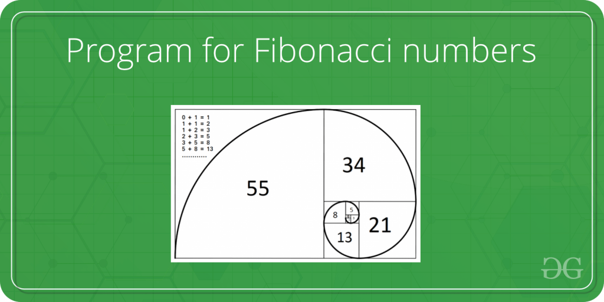

# Nth Fibonacci Number

Given a number n, print n-th Fibonacci Number. 

    The Fibonacci numbers are the numbers in the following integer sequence: 0, 1, 1, 2, 3, 5, 8, 13, 21, 34, 55, 89, 144, ……..

Examples: 

    Input  : n = 1

    Output : 1

    Input  : n = 9

    Output : 34

    Input  : n = 10

    Output : 55

## Conclussions

The outcomes align with expectations: the recursive method under-performs compared to iterative and dynamic programming approaches due to redundant calculations. Iterative and dynamic programming methods are closely matched in efficiency, but the iterative approach edges out slightly due to its lower memory footprint, as it doesn't require storing intermediate results. Dynamic programming, while efficient, necessitates additional memory for storing these results. Thus, for Fibonacci number calculations, the iterative method is preferred for its balance of efficiency and minimal memory usage. However, calculating large Fibonacci numbers remains a challenge due to the limitations in storing very large numbers.

    Iterative > Dynamic programming > Recursive